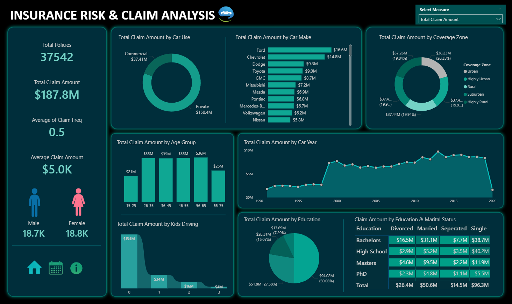

# Insurance Risk & Claim Analysis

### 📌 Project Overview
This project is an interactive Power BI dashboard built to analyze insurance policies and claim patterns. The goal is to provide stakeholders with clear insights into customer demographics, claim behaviours, and risk factors, enabling data-driven business decisions.

### 🏢 Business Problem
The insurance company’s policy and claims data were scattered across multiple sources, making it difficult to:
- Track overall performance
- Identify claim trends and customer risk profiles
- Segment customers effectively for policy targeting
  
This dashboard centralizes the data into one place and provides key KPIs and visual insights for better decision-making.

### 🎯 Key Features & KPIs
- Total Policies – Active customer base size
- Total Claim Amount – Overall financial impact of claims
- Claim Frequency – Frequency of claims filed
- Average Claim Amount – Claim severity & risk exposure
- Gender-wise Policies – Customer distribution by gender

### 📊 Visualizations Included
- By Car Use (Donut Chart) – Policy & claims by car usage (personal/commercial)
- By Car Make (Bar Chart) – Brand-based risks and claims
- By Coverage Zone (Donut Chart) – Geographic distribution of policies & claims
- By Age Group (Histogram) – Claim frequency by customer age brackets
- By Car Year (Area Chart) – Impact of car age on policies & claims
- By Kids Driving (Ribbon Chart) – Effect of young drivers on claims and policies
- By Education (Pie Chart) – Correlation between education and insurance adoption
- By Education & Marital Status (Heat Matrix) – Combined effect on policies & claims

### ⚙️ Tech Stack
- Power BI – Dashboard design & visualization
- Excel / CSV – Data source preparation
- DAX – Measures & calculated columns

### Dashboard

